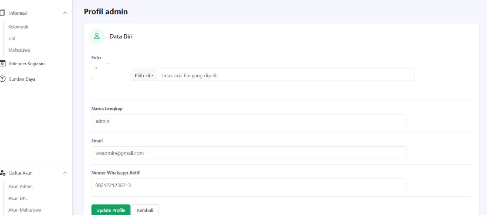

## System Design

### Use Case Diagram
Diagram use case menggambarkan interaksi antara pengguna
(mahasiswa dan admin) dengan sistem KKN.

---

### Activity Diagram
Activity diagram menjelaskan alur proses pendaftaran KKN
mulai dari pengisian data hingga proses verifikasi.

---

### Class Diagram
Class diagram menunjukkan struktur kelas dan relasi antar kelas
yang digunakan dalam pengembangan sistem.

## Application Preview

Berikut adalah beberapa tampilan utama dari aplikasi
Sistem Informasi Pendaftaran KKN.

